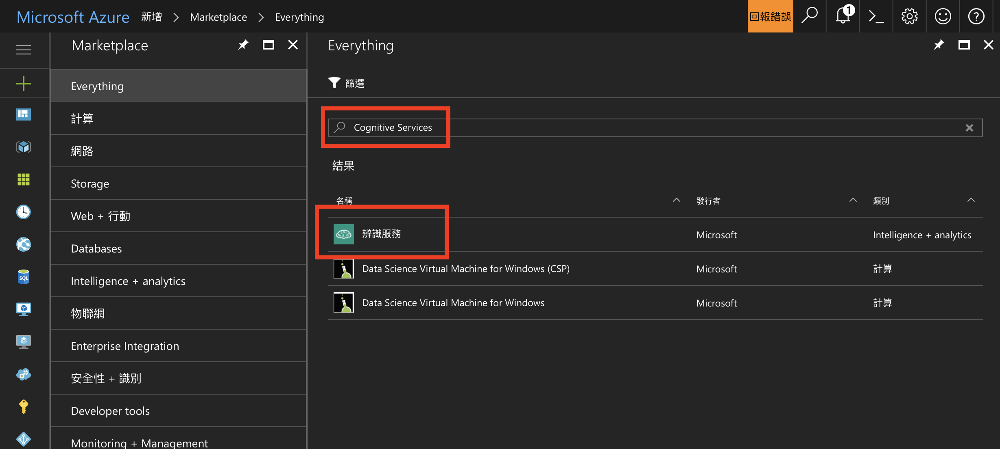
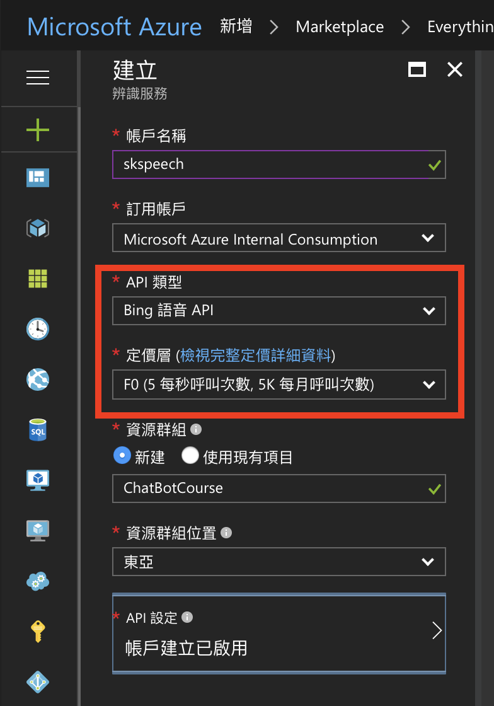
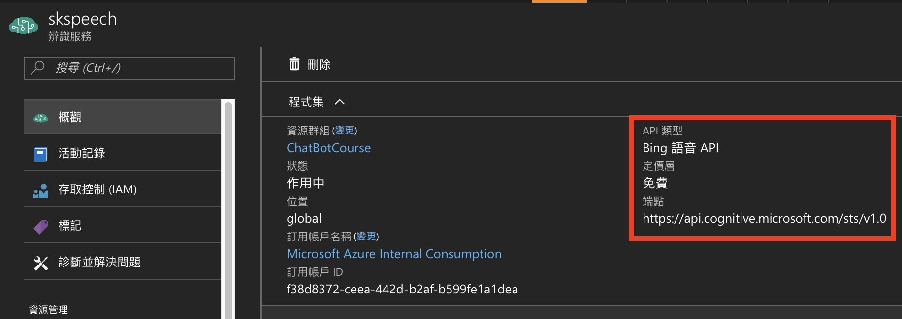
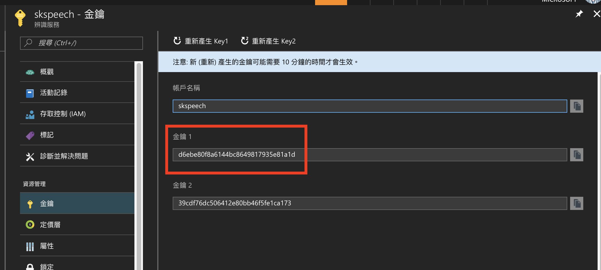

# Set Up Microsoft Cognitive Services API Services

This guide show you how to set up the Microsoft Cognitive Service API and retrieve the API Key.

## Prerequisites

* Microsoft Account (i.e. Live ID/Skype/XBox Live. **FREE** [Sign Up](https://signup.live.com/).)
* Microsoft Azure Subscription (contact your TA).
* A basic knowledge about HTTP and RESTful APIs.

## Steps

1. Log in the [Microsoft Azure management portal](https://portal.azure.com/) with your Microsoft account (that activated the Azure subscription). Click the **+** icon at the left top corner and search for the _Cognitive Services_.

   

2. Set up the properties of the service. Pay attention to select correct **API Type** and **Pricing**.

   

3. After creating the service, you will get a service dashboard to show you the information of API usages. Check the _API Type_, _Pricing_, and _Service Endpoint_.

   

4. Scroll down the service dashboard and click the **API Key** section. Then, you can start using (and managing) the API keys for accessing the service.

   > Both _Key 1_ and _Key 2_ can be used to access the service. You can also re-generate them if they were leaked.

   

## References

* [Create a Cognitive Services APIs account in the Azure Portal](https://docs.microsoft.com/azure/cognitive-services/cognitive-services-apis-create-account)